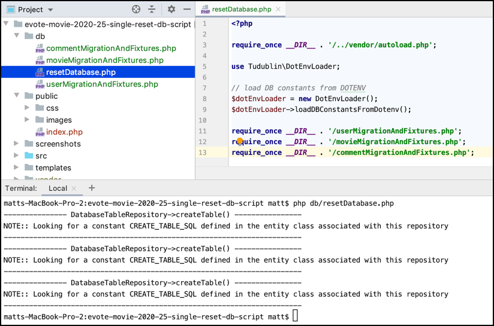

# evote-movie-2020-25-single-reset-db-script

Let's tidy things up, to have a single master script to run all our database setup and fixtures.



- so all we now need to do is tidy up our migration and fixtures scripts. First let's write the master DB setup script `/db/resetDatabase.php`:
    
    ```php
    <?php
    require_once __DIR__ . '/../vendor/autoload.php';
    
    use Tudublin\DotEnvLoader;
    
    // load DB constants from DOTENV
    $dotEnvLoader = new DotEnvLoader();
    $dotEnvLoader->loadDBConstantsFromDotenv();
    
    require_once __DIR__ . '/userMigrationAndFixtures.php';
    require_once __DIR__ . '/movieMigrationAndFixtures.php';
    require_once __DIR__ . '/commentMigrationAndFixtures.php';
    ```
  
    - this script runs the DotEnvLoader, to set our global DB constants, then loads and runs the 3 migration and fixture scripts
    

- so all we now need to do is tidy up our migration and fixtures scripts. First let's write the master DB setup script `/db/resetDatabase.php`:
    
    ```php
    <?php
    require_once __DIR__ . '/../vendor/autoload.php';
    
    use Tudublin\DotEnvLoader;
    
    // load DB constants from DOTENV
    $dotEnvLoader = new DotEnvLoader();
    $dotEnvLoader->loadDBConstantsFromDotenv();
    
    require_once __DIR__ . '/userMigrationAndFixtures.php';
    require_once __DIR__ . '/movieMigrationAndFixtures.php';
    require_once __DIR__ . '/commentMigrationAndFixtures.php';
    ```
  
    - this script runs the DotEnvLoader, to set our global DB constants, then loads and runs the 3 migration and fixture scripts
    
- since we now have several migration and fixture scripts, I've standardized the naming as `<table>MigrationAndFixtures.php`

- the only edit we need to make for the contents of these scripts is as follows:

    - they don't need run the DotEnvLoader, since that is now the responsibility of `resetDatabase.php`
    
    - we'll comment out the `var_dump()`, since it will mean too mcuh text in the middle of our testing output
    
- now `userMigrationAndFixtures.php` contains:
    
    ```php
    <?php
    require_once __DIR__ . '/../vendor/autoload.php';
    
    use Tudublin\UserRepository;
    use Tudublin\User;
    
    //--------- MOVIE ---------
    // (1) drop then create table
    $userRepository = new UserRepository();
    $userRepository->dropTable();
    $userRepository->createTable();
    
    // (2) delete any existing objects
    $userRepository->deleteAll();
    
    // (3) create objects
    $u1 = new User();
    $u1->setUsername('matt');
    $u1->setPassword('smith');
    
    $u2 = new User();
    $u2->setUsername('admin');
    $u2->setPassword('admin');
    $u2->setRole('ROLE_ADMIN');
    
    // (3) insert objects into DB
    $userRepository->create($u1);
    $userRepository->create($u2);
    
    //// (4) test objects are there
    //$users = $userRepository->findAll();
    //print '<pre>';
    //var_dump($users);
    ```

- now `movieMigrationAndFixtures.php` contains:
    
    ```php
    <?php
    require_once __DIR__ . '/../vendor/autoload.php';
    
    use Tudublin\Movie;
    use Tudublin\MovieRepository;
    
    $movieRespository = new MovieRepository();
    
    // (1) drop then create table
    $movieRespository->dropTable();
    $movieRespository->createTable();
    
    // (2) delete any existing objects
    $movieRespository->deleteAll();
    
    // (3) create objects
    $m1 = new Movie();
    $m1->setId(1);
    $m1->setTitle('Jaws');
    $m1->setCategory('thriller');
    $m1->setPrice(10.00);
    $m1->setVoteTotal(5);
    $m1->setNumVotes(1);
    
    $m2 = new Movie();
    $m2->setId(2);
    $m2->setTitle('Jaws II');
    $m2->setCategory('thriller');
    $m2->setPrice(5.99);
    $m2->setVoteTotal(77 * 90);
    $m2->setNumVotes(77);
    
    $m3 = new Movie();
    $m3->setId(3);
    $m3->setTitle('Shrek');
    $m3->setCategory('comedy');
    $m3->setPrice(10);
    $m3->setVoteTotal(5 * 50);
    $m3->setNumVotes(5);
    
    $m4 = new Movie();
    $m4->setId(4);
    $m4->setTitle('Shrek II');
    $m4->setCategory('comedy');
    $m4->setPrice(4.99);
    $m4->setVoteTotal(0);
    $m4->setNumVotes(0);
    
    $m5 = new Movie();
    $m5->setId(5);
    $m5->setTitle('Alien');
    $m5->setCategory('scifi');
    $m5->setPrice(19.99);
    $m5->setVoteTotal(95 * 201);
    $m5->setNumVotes(201);
    
    // (4) insert objects into DB
    $movieRespository->create($m1);
    $movieRespository->create($m2);
    $movieRespository->create($m3);
    $movieRespository->create($m4);
    $movieRespository->create($m5);
    
    //// (5) test objects are there
    //$movies = $movieRespository->findAll();
    //print '<pre>';
    //var_dump($movies);
    ```

- now `commentMigrationAndFixtures.php` contains:
    
    ```php
    <?php
    require_once __DIR__ . '/../vendor/autoload.php';
    
    use Tudublin\CommentRepository;
    
    $commentRespository = new CommentRepository();
    
    // (1) drop then create table
    $commentRespository->dropTable();
    $commentRespository->createTable();
    
    // (2) delete any existing objects
    $commentRespository->deleteAll();
    ```

- when we run our acceptance tests we get this output, and most importantly, the DB has been reset removing all traces of changes made by our test methods:
    
    ```bash
    $ php vendor/bin/codecept run acceptance
    Codeception PHP Testing Framework v4.1.4
    Powered by PHPUnit 9.1.1 by Sebastian Bergmann and contributors.
    Running with seed: 
    
    Acceptance Tests (5) -----
    - CreateMovieCest: Create movie and see in list--------------- DatabaseTableRepository->createTable() ----------------
    NOTE:: Looking for a constant CREATE_TABLE_SQL defined in the entity class associated with this repository
    -----------------------------------------------------------------------
    --------------- DatabaseTableRepository->createTable() ----------------
    NOTE:: Looking for a constant CREATE_TABLE_SQL defined in the entity class associated with this repository
    -----------------------------------------------------------------------
    --------------- DatabaseTableRepository->createTable() ----------------
    NOTE:: Looking for a constant CREATE_TABLE_SQL defined in the entity class associated with this repository
    -----------------------------------------------------------------------
    ✔ CreateMovieCest: Create movie and see in list (0.89s)
    ✔ HomepageCest: Homepage has homepage text (0.11s)
    ✔ HomepageCest: Homepage has working login link (0.18s)
    ✔ HomepageCest: Login works for admin admin (0.24s)
    ✔ HomepageCest: Login works for admin admin using submit form (0.24s)
    ---------
    
    Time: 00:01.782, Memory: 12.00 MB
    
    OK (5 tests, 14 assertions)
    ```
  